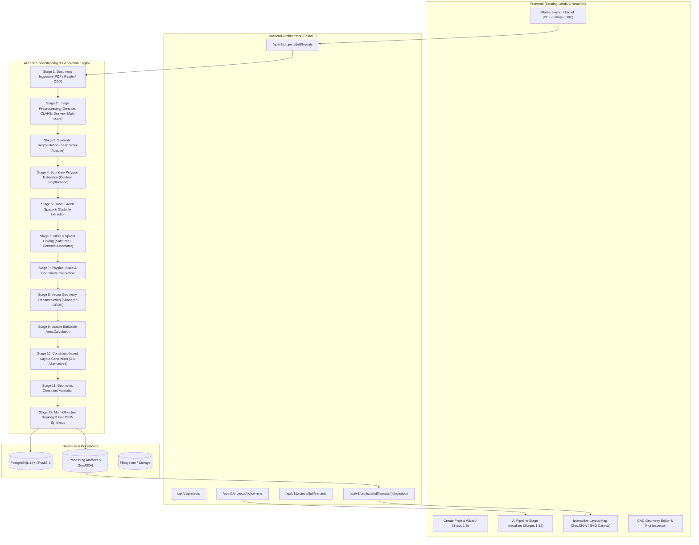

# LandOS AI Architecture & Research Pipeline Specification

> **Document Version:** 1.0.0  
> **Status:** Production Architecture Blueprint & Research Specification  
> **Target System:** Existing LandOS Project (Python FastAPI + PostgreSQL + React/Vite)

---

## 1. Executive Summary & Technical Audit

LandOS is an existing enterprise land management and layout engineering platform. This architectural specification defines the integration of a **research-oriented AI land-understanding and computational geometry engine**.

Instead of relying on naive heuristic subdivision or bounding-box distribution, the new architecture introduces a **12-stage perception-to-geometry pipeline**:
1. Ingests raw multi-format blueprints (PDF, PNG, JPG, CAD/DXF).
2. Performs vision-transformer semantic segmentation (SegFormer primary adapter) with modular extensibility (Mask2Former).
3. Extracts authentic non-rectangular land boundaries, road networks, open/green spaces, obstacles, and buildable development polygons using OpenCV and Shapely (GEOS).
4. Executes OCR and spatial token-to-polygon linking.
5. Performs physical scale calibration (pixels $\to$ physical feet/meters).
6. Computes exact **Buildable Area** ($\text{Boundary} - \text{Setbacks} - \text{Roads} - \text{Green Spaces} - \text{Obstacles}$).
7. Generates **3–4 valid, civilly compliant alternative plot layouts** (Max Plots, Balanced, Max Green Space, Premium Accessibility).
8. Validates all geometric constraints (no boundary violations, no overlap, road frontage).
9. Ranks variants via a composite objective scoring function.
10. Emits standard **GeoJSON FeatureCollections** and SVG for direct interactive rendering in the existing LandOS Layout Map UI, with a stage-by-stage AI processing visualizer.

---

## 2. Current Architecture vs. Proposed Architecture

### 2.1 Current System State
- **Frontend:** React 18 + Vite, React Router v6, Lucide React, Vanilla CSS custom design system (`--df-*` token variables).
- **Backend:** Python 3.10+ FastAPI, Pydantic v2 schemas, Uvicorn, background workers.
- **Database:** PostgreSQL with SQLAlchemy ORM (tables: `projects`, `project_locations`, `project_surveys`, `project_commercials`, `project_legal`, `layout_sources`, `layout_processing_jobs`, `layout_processing_artifacts`, `project_plots`, `generated_layout_variants`).
- **Storage:** Local filesystem (`backend/uploads/projects/{project_id}/layouts/`) + PostgreSQL `layout_processing_artifacts` JSON/Base64 table.
- **Current Limitation:** Layout generation previously relied on parametric rectangular bounding boxes (`length_ft`, `breadth_ft`) rather than directly consuming the extracted irregular polygon geometry and constraints from the ingested blueprints.

### 2.2 Proposed Architecture Overview



---

## 3. Detailed Answers to Architecture Audit Questions

| # | Audit Item | Findings in Current Codebase |
|---|---|---|
| **1** | **Frontend Framework** | React 18, Vite 5, React Router v6, Lucide React icons, Vanilla CSS design tokens. No TailwindCSS. |
| **2** | **Backend Framework** | Python FastAPI (`app.main:app`), Pydantic Settings, SQLAlchemy ORM, Uvicorn on port 8000. |
| **3** | **Database** | PostgreSQL (`landos_db`) configured via `app.db.session.SessionLocal`. Fully normalized relational tables. |
| **4** | **Project Creation Flow** | 5-step wizard in `CreateProject/index.jsx`: Identity $\to$ Location $\to$ Commercial $\to$ Layout Upload $\to$ Review. Submits `POST /api/v1/projects`. |
| **5** | **File Upload Flow** | `projectService.uploadLayoutFile` posts multipart form to `POST /api/v1/projects/{id}/layouts`. Persists file to `backend/uploads/projects/{id}/layouts/{uuid}_{filename}`, creates `LayoutSource` and enqueues `LayoutProcessingJob`. |
| **6** | **Plot Model / Schema** | `project_plots` table (plot_number, polygon_geojson, calculated_area_sqft, status, price, facing, centroid_x, centroid_y). `generated_layout_variants` table (strategy_name, layout_model_json, svg_content, total_plots, utilization_percent, is_selected). |
| **7** | **Layout Map Implementation** | `frontend/src/pages/Projects/ProjectWorkspace/tabs/LayoutMap.jsx`: Renders SVG canvas with pan/zoom, alternative selector tabs (Variants 1-4), plot click drawer, CAD editor trigger (`GeometryEditorModal`), DXF/GeoJSON/CSV export menu. |
| **8** | **Existing API Routes** | `/api/v1/projects`, `/api/v1/projects/{id}/layouts`, `/api/v1/projects/{id}/ai-runs`, `/api/v1/projects/{id}/variants`, `/api/v1/projects/{id}/plots`, `/api/v1/benchmark`. |
| **9** | **Authentication** | Modular role-based stub (`frontend/src/services/auth.service.js`) with roles `ADMIN`, `BROKER`, `CUSTOMER`. Admin retains full generation/editing rights; broker/customer view permitted scopes. |
| **10** | **Existing Storage** | Local directory `backend/uploads/` and `storage/` + PostgreSQL `layout_processing_artifacts` for JSON/GeoJSON intermediate stages. |
| **11** | **Environment Variables** | In `.env`: `PROJECT_NAME`, `VERSION`, `CORS_ORIGINS`, `POSTGRES_SERVER`, `POSTGRES_PORT`, `POSTGRES_USER`, `POSTGRES_PASSWORD`, `POSTGRES_DB`. |

---

## 4. AI Land Understanding & Layout Generation Pipeline

### Stage 1: Document Ingestion (`InputIngestionEngine`)
- **Formats:** PDF, PNG, JPG, JPEG, TIFF, DXF.
- **Vector vs. Raster Detection:**
  - If Vector PDF: Extracts vector stream primitives directly using PyMuPDF (`fitz`), preserving original coordinate precision without downsampling.
  - If Raster Image / Scanned Blueprint: Reads at native resolution with DPI awareness.
- **Storage:** Preserves immutable `original_file` on disk, records DPI, dimensions, page count, and coordinate transforms.

### Stage 2: Image Preprocessing (`ImagePreprocessor`)
- Multi-scale pyramid representation ($1\times, 0.5\times, 0.25\times$).
- Noise reduction (Gaussian filter), contrast enhancement via CLAHE (`clipLimit=2.0`, `tileGridSize=(8,8)`).
- Automatic deskewing via minimum bounding area moment analysis.
- Separate retention of `original_image`, `preprocessed_image`, and `normalized_image`.

### Stage 3: Semantic Segmentation (`SegmentationEngine` + SegFormer Adapter)
- **Primary Model:** Single modular `SegFormerSegmentationModel` (or optional `Mask2FormerAdapter`).
- **Semantic Classes:**
  - `0: BACKGROUND`
  - `1: LAND_BOUNDARY`
  - `2: ROAD`
  - `3: BUILDING / STRUCTURE`
  - `4: OPEN_SPACE / VEGETATION`
  - `5: WATER`
  - `6: OBSTACLE / EXCLUSION`
  - `7: PLOT_BOUNDARY_LINE`
- **Output:** Stitched full-resolution class probability maps $[C \times H \times W]$ and class binary masks.

### Stage 4: True Land Boundary Extraction (`BoundaryDetectionEngine`)
- Replaces naive rectangular bounding boxes.
- Extracts candidate outer contours from class `LAND_BOUNDARY` mask.
- Morphological closing $\to$ Polygonization $\to$ Douglas-Peucker polygon simplification ($\epsilon = 0.015 \times \text{perimeter}$).
- GEOS validity enforcement via Shapely (`buffer(0)` self-intersection repair).
- Produces valid `LAND_BOUNDARY_POLYGON`.

### Stage 5: Features & Road Network Extraction (`RoadDetectionEngine`, `FeatureExtractor`)
- Extracts road corridors, external access roads, and internal circulation pathways.
- Converts to Shapely `LineString` (centerlines) and `Polygon` (road corridors).
- Extracts green/open spaces and water bodies as `RESERVED_POLYGON` exclusion zones.

### Stage 6: OCR & Spatial Linking Engine (`OCRTextEngine` + `SpatialAssociator`)
- Extracts plot numbers (`"P-001"`, `"PLOT-14"`), dimensions (`"30 x 40"`, `"9M ROAD"`), areas (`"1200 SQFT"`), and north directions.
- Spatial linkage: Calculates geometric containment or nearest-centroid distance between OCR text bounding boxes and polygon primitives to establish plot identity.

### Stage 7: Physical Scale & Coordinate Calibration (`ScaleCalibrator`)
- Establishes transformation matrix: $\text{Pixel Coordinates} \xrightarrow{T} \text{Normalized Physical Coordinates (Feet / Meters)}$.
- Calibration inputs: Explicit dimension text (e.g. 30 ft road width), scale annotations (e.g. 1:500), or project gross area calibration.

### Stage 8: Vector Geometry Reconstruction (`GeometricReconstructionEngine`)
- Assembles validated Shapely `Polygon` and `LineString` primitives.
- Verifies topology: no self-intersections, no zero-area slivers, strictly non-overlapping.

### Stage 9: Usable Buildable Area Calculation (`BuildableRegionEngine`)
$$\text{Buildable Area} = \text{Land Boundary} \setminus (\text{Setbacks} \cup \text{Roads} \cup \text{Open/Green Spaces} \cup \text{Water} \cup \text{Obstacles})$$
- Forms the true spatial domain for plot subdivision.

### Stage 10: Multi-Alternative Plot Generation (`LayoutGeneratorEngine`)
Generates 4 distinct, geometrically valid design variants strictly inside the `Buildable Area`:
- **Variant A (Maximum Density / Plot Count):** Optimizes orthogonal plot packing.
- **Variant B (Balanced Layout):** Standard 30×40 ft / 1200 sq ft plots with balanced road corridors.
- **Variant C (Eco / Open-Space Maximization):** 15–20% open green corridors, central park integration.
- **Variant D (Premium Accessibility / Wide Frontage):** Arterial spine with wider road frontage and corner plot premiums.

### Stage 11: Geometric Constraint Validation (`ConstraintValidationEngine`)
Evaluates every candidate layout against 12 civil engineering rules:
1. All plots strictly contained inside outer land boundary ($\text{Plot} \subseteq \text{Land Boundary}$).
2. Zero overlap with road corridors ($\text{Plot} \cap \text{Road} = \emptyset$).
3. Zero overlap with open/green spaces ($\text{Plot} \cap \text{Green Space} = \emptyset$).
4. Zero overlap with obstacles/water bodies.
5. Zero plot-to-plot mutual intersection ($\text{Plot}_i \cap \text{Plot}_j = \emptyset, \forall i \neq j$).
6. Minimum plot area constraint satisfied ($\text{Area} \ge \text{min\_plot\_sqft}$).
7. Minimum frontage width satisfied ($\text{Width} \ge \text{min\_frontage\_ft}$).
8. Direct road access verified for every plot.
9. Polygon topological validity verified (GEOS `is_valid == True`).
10. No self-intersecting polygon rings.
11. Boundary setbacks satisfied.
12. Road corridor width compliant.

### Stage 12: Layout Scoring & Ranking (`LayoutScorer`)
$$\text{Composite Score} = w_1 \cdot U + w_2 \cdot A + w_3 \cdot R + w_4 \cdot N + w_5 \cdot B - w_6 \cdot V$$
Where:
- $U$: Land Area Utilization ($\text{Total Plot Area} / \text{Gross Land Area}$)
- $A$: Road Accessibility Index
- $R$: Plot Regularity & Aspect Ratio Compliance
- $N$: Normalized Plot Yield
- $B$: Boundary Contour Fit
- $V$: Penalty for constraint boundary proximity/violations

---

## 5. UI Stage Visualizer Design (Layout Map Enhancement)

When an AI job is triggered, the existing Layout Map tab renders an **AI Processing Pipeline Visualizer** showing live progress across all 12 stages:

```
[ Stage 1: Ingestion ] ──────> [ Stage 2: Preprocessing ] ──────> [ Stage 3: Semantic Segmentation ]
         │                                                                   │
         ▼                                                                   ▼
[ Stage 6: OCR & Labels ] <─── [ Stage 5: Feature Extraction ] <─── [ Stage 4: Boundary Extraction ]
         │
         ▼
[ Stage 7: Scale Calibration ] ──> [ Stage 8: Geometry Reconstruct ] ──> [ Stage 9: Buildable Area ]
                                                                                   │
                                                                                   ▼
[ Stage 12: 4 Alternative Layouts ] <── [ Stage 11: Validation ] <── [ Stage 10: Plot Generation ]
```

Each stage displays:
- Stage name & status (Queued, Running, Completed, Low Confidence Alert).
- Intermediate inspectable artifact button (e.g. view preprocessed binarized image, segmentation mask overlay, detected boundary polygon, buildable area polygon).
- Execution timing and confidence score.

Once Stage 12 completes, the UI smoothly transitions to render the 4 interactive Alternative Layouts (with active switcher, master layout confirmation, plot drawer, and CAD editor).

---

## 6. Codebase File Modification Map

### 6.1 Untouched Files (Preserving Existing Core LandOS UI & Management)
- `frontend/src/pages/Dashboard/*`
- `frontend/src/pages/Customers/*`
- `frontend/src/pages/Brokers/*`
- `frontend/src/pages/Payments/*`
- `frontend/src/pages/Documents/*`
- `frontend/src/pages/Analytics/*`
- `frontend/src/pages/Settings/*`
- `frontend/src/pages/Projects/ProjectList/*`, `ProjectTable.jsx`, `ProjectToolbar.jsx`, `ProjectForm.jsx`, `ProjectCard.jsx`
- `frontend/src/pages/Projects/ProjectWorkspace/tabs/Overview.jsx`, `PlotsTable.jsx`, `ProjectAnalytics.jsx`, `ProjectBrokers.jsx`, `ProjectCustomers.jsx`, `ProjectDocuments.jsx`, `ProjectPayments.jsx`, `ProjectSettings.jsx`
- `frontend/src/layouts/*`, `frontend/src/components/navigation/*`

### 6.2 Files to Enhance / Modify
- `backend/app/engine/pipeline.py` & `pipeline_stages_a.py`, `pipeline_stages_b.py`: Ensure unified 12-stage execution flow with complete artifact persistence.
- `backend/app/engine/segmentation_engine.py`: Single SegFormer adapter + modular interface.
- `backend/app/engine/boundary_detection_engine.py`: Authentic outer contour polygonization and GEOS simplification.
- `backend/app/engine/layout_generator/layout_generator_engine.py`: Consume true extracted `ParsedLand` polygon and `buildable_area` rather than bounding box fallback.
- `backend/app/engine/layout_generator/plot_subdivider.py`: Implement robust polygon recursive/grid subdivision strictly bounded inside `buildable_area`.
- `backend/app/api/v1/endpoints/ai_pipeline.py`: Support stage-by-stage status polling and intermediate artifact retrieval.
- `frontend/src/pages/Projects/ProjectWorkspace/tabs/LayoutMap.jsx`: Add AI Processing Pipeline Visualizer component and GeoJSON/SVG render integration.
- `frontend/src/services/projectService.js`: Connect stage status polling, artifact inspection, and multi-alternative GeoJSON endpoints.

### 6.3 New Modules to Introduce
- `backend/app/engine/buildable_area_engine.py`: Computes exact topological difference ($\text{Boundary} - \text{Constraints}$).
- `backend/app/engine/constraint_validation_engine.py`: Comprehensive 12-rule geometric validator with violation diagnostics.
- `backend/app/engine/layout_scorer.py`: Multi-objective ranking function for research benchmarking.
- `frontend/src/pages/Projects/ProjectWorkspace/components/AIProcessingVisualizer.jsx`: Beautiful stage-by-stage interactive progress and intermediate inspection UI.

---

## 7. Implementation Roadmap & Staging

| Phase | Description | Deliverables | Status |
|---|---|---|---|
| **Phase 1** | Codebase Audit & Architecture Specification | `LANDOS_AI_ARCHITECTURE.md`, Implementation Plan | **COMPLETED** |
| **Phase 2** | Source Document Ingestion & Storage Metadata | Multi-format PDF/Raster/DXF handler, scale ratio calibration, metadata tracking | **READY TO EXECUTE** |
| **Phase 3** | Preprocessing & Multi-Scale Normalization | CLAHE, deskewing, Gaussian denoising, multi-scale pyramid artifacts | Scheduled Next |
| **Phase 4** | Semantic Segmentation (Single SegFormer Adapter) | SegFormer patch tiling, probability stitching, 7-class mask generation | Scheduled Next |
| **Phase 5** | Boundary & Feature Extraction | Contour simplification, polygon validation, road & green space polygons | Scheduled Next |
| **Phase 6** | OCR & Spatial Token Linking | Token sanitizer, dimension parser, centroid spatial associator | Scheduled Next |
| **Phase 7** | Vector Geometry Reconstruction | Shapely/GEOS polygon synthesizer, WKT/GeoJSON export | Scheduled Next |
| **Phase 8** | Usable Buildable Area Calculation | Exact constraint subtraction engine | Scheduled Next |
| **Phase 9** | Constraint-Based Plot Generation | 4 distinct design strategies strictly inside buildable area | Scheduled Next |
| **Phase 10** | Geometric Validation Engine | 12 civil engineering rule checker with score & diagnostics | Scheduled Next |
| **Phase 11** | Multi-Alternative Scoring & Ranking | Multi-objective ranking, variant metadata synthesis | Scheduled Next |
| **Phase 12** | Interactive Layout Map & UI Stage Visualizer | Real-time stage visualizer + GeoJSON/SVG interactive map | Scheduled Next |
| **Phase 13** | Admin Editing & Feedback Collection | CAD editor integration, revision tracking, correction dataset logging | Scheduled Next |
| **Phase 14** | Research Benchmarking Suite | IoU, overlap rate, boundary fit, generation time metrics | Scheduled Next |

---

## 8. Principle Compliance Checklist

- [x] **No Project Rebuild:** Preserves existing React + Vite frontend and FastAPI backend structure.
- [x] **No UI Redesign:** Preserves all sidebars, navbars, customer/broker/payment/document/analytics tabs.
- [x] **Single Segmentation Model:** Uses SegFormer adapter in production inference; no concurrent U-Net + SegFormer + Mask2Former chaining.
- [x] **Zero Fake / Hardcoded Data:** All geometry is derived from authentic source documents or explicit user constraints.
- [x] **Strict Boundary Containment:** Zero plots placed outside the actual land boundary or across road/green space constraints.
- [x] **Inspectable Intermediate Stages:** Every AI pipeline stage emits inspectable artifacts for research visualization.
