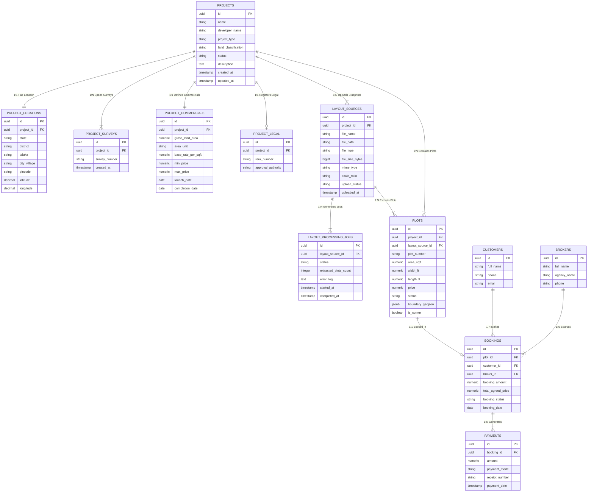

# LandOS — Master Database Schema v1 & Domain Architecture

**Document Status:** Frozen Architectural Design Specification (Phase P2.1)  
**Scope:** Project Creation, Blueprint File Hand-off, Layout Parsing Engine Outputs, Plot Domain, and Future Transaction Links  

---

## 1. Complete System ER Diagram (LandOS v1 Core)



---

## 2. Deep-Dive: 10 Architectural Design Questions Answered

### Question 1: What data is actually entered during Create Project?
During the 5-step Create Project wizard, the Admin provides **user-entered inputs** that establish the legal, administrative, commercial, and blueprint identity of the land:
- **Identity:** Project Name, Developer Entity, Project Type, Land Classification, Description.
- **Location & Survey:** State, District, Taluka, City/Village, Pincode, Survey/Gut/Khasra Numbers (tag array), Latitude, Longitude, RERA No., Approving Authority.
- **Commercial:** Gross Land Area, Area Measurement Unit, Base Rate per Sq. Ft., Min Price, Max Price, Target Launch Date, Completion Date.
- **Master Layout Blueprint:** File name, File size, MIME type, Scale Ratio calibration.

---

### Question 2: What belongs in `projects` vs. Child Tables (Normalization Strategy)?

| Entity / Table | Storage Purpose | Rationale for Normalization (Why not one big table?) |
|---|---|---|
| **`projects`** | Core Master Identity & Lifecycle Status | Acts as the central anchor entity for all queries, authorization rules, and workspace views. |
| **`project_locations`** | Physical & Geographical Address | Separated because spatial coordinates (Lat/Long, GIS boundary boxes) undergo spatial indexing (PostGIS) distinct from project names. |
| **`project_surveys`** | Individual Survey / Gut / Khasra Numbers | **Normalized 1-to-Many Child Table.** A single project often spans multiple land parcels (e.g. `Gut No. 142/1`, `142/2B`). Storing them in a separate table allows indexing per survey number so LandOS can query all projects covering a specific government land survey parcel. |
| **`project_commercials`** | Land Area & Base Pricing Baselines | Separated to store numeric values (`gross_land_area`, `base_rate_per_sqft`) in numeric SQL types (`NUMERIC(14,4)`), allowing SQL SUM, AVG, and unit conversion algorithms without string parsing. |
| **`project_legal`** | Government Approvals & RERA Registrations | Separated to isolate legal regulatory compliance attributes. |
| **`layout_sources`** | Uploaded Master Blueprint Artifacts | **Normalized 1-to-Many Child Table.** A project can have multiple blueprint file revisions over its lifetime (e.g., Original Blueprint V1, Revised RERA Layout V2). |

---

### Question 3: What happens when a PDF / DWG / Image layout file is uploaded?

```
[Admin Uploads File] ──> [FastAPI Save to Disk/S3] ──> [INSERT layout_sources] ──> [INSERT layout_processing_jobs] ──> [Project Status = 'LAYOUT_PENDING']
```

1. Admin attaches `master_layout.pdf` during Step 4.
2. Backend receives binary file and saves it securely to object storage (`/uploads/projects/{project_id}/layouts/{layout_source_id}.pdf`).
3. Backend inserts a record into `layout_sources` (`upload_status = 'UPLOADED'`).
4. Backend inserts a job record into `layout_processing_jobs` (`status = 'QUEUED'`).
5. Project status is set to `LAYOUT_PENDING`.

---

### Question 4 & 5: What information the AI / Layout Scanner extracts & stores in PostgreSQL

When the future spatial processing engine processes `layout_sources`, it extracts and stores:

1. **Polygon Geometry Coordinates (`boundary_geojson`):** The exact vector boundary vertices (X, Y or Lat/Long) defining each plot outline.
2. **Plot Numbers (`plot_number`):** Text identifiers parsed via OCR or CAD text layers (e.g., `Plot A-101`, `Plot A-102`).
3. **Plot Net Area (`area_sqft`):** Calculated area in Sq. Ft. from polygon dimensions.
4. **Plot Dimensions (`width_ft`, `length_ft`):** Frontage width and depth (e.g., `30.0 ft x 50.0 ft`).
5. **Corner Plot Flag (`is_corner`):** Boolean indicating if plot borders two roads.
6. **Road & Open Green Space Networks:** Vector geometries representing roads, parks, and amenity zones.

All extracted plots are stored in the **`plots`** table, linked via `project_id` and `layout_source_id`.

---

### Question 6: How a scanned layout becomes individual `plots`

The layout parser transforms a blueprint into database plot entities via this pipeline:

```
Blueprint File ──> OpenCV/CAD Parser ──> Contour Extraction ──> OCR Text Match ──> SQL INSERT into `plots` table
```

For every contour detected in the blueprint:
```sql
INSERT INTO plots (id, project_id, layout_source_id, plot_number, area_sqft, width_ft, length_ft, status, boundary_geojson, is_corner)
VALUES (
  'c56a4180-65aa-42ec-a945-5fd21dec0538',
  'proj_1092',
  'layout_8821',
  'Plot A-101',
  1500.0,
  30.0,
  50.0,
  'AVAILABLE',
  '{"type": "Polygon", "coordinates": [[[73.85, 18.52], [73.86, 18.52], ...]]}',
  true
);
```

---

### Question 7: How Plots connect to Customers, Brokers & Payments later

The **`PLOTS`** entity is the central pivot table of LandOS. Every commercial transaction anchors to an individual plot:

- **Plot Status Lifecycle:** `AVAILABLE` → `RESERVED` → `SOLD` → `BLOCKED`
- **`BOOKINGS` Table:** Links a `plot_id` to a `customer_id` and a `broker_id`.
- **`PAYMENTS` Table:** Tracks installment receipts (down payments, EMI schedules) linked to a `booking_id`.

---

### Question 8: How the Project Workspace retrieves everything

The React Project Workspace queries normalized endpoints designed for specific UI views:

1. **Workspace Header & Overview (`GET /api/v1/projects/{id}`):**  
   Returns project master identity, location summary, gross land area, and processing status (`LAYOUT_PENDING`, `DRAFT`, `ACTIVE`).
2. **Interactive Layout Map (`GET /api/v1/projects/{id}/layout-map`):**  
   Returns GeoJSON array of all plot boundaries (`boundary_geojson`) and plot statuses for SVG/Canvas rendering.
3. **Plots Table Spreadsheet (`GET /api/v1/projects/{id}/plots`):**  
   Returns tabulated list of plots with status, area, price, customer name, and broker name.

---

### Question 9: PostgreSQL Constraints & Relationships Index

```sql
-- Core Project Table
CREATE TABLE projects (
    id UUID PRIMARY KEY DEFAULT gen_random_uuid(),
    name VARCHAR(255) NOT NULL,
    developer_name VARCHAR(255) NOT NULL,
    project_type VARCHAR(50) NOT NULL,
    land_classification VARCHAR(50) NOT NULL,
    status VARCHAR(50) NOT NULL DEFAULT 'DRAFT',
    description TEXT,
    created_at TIMESTAMP WITH TIME ZONE DEFAULT CURRENT_TIMESTAMP,
    updated_at TIMESTAMP WITH TIME ZONE DEFAULT CURRENT_TIMESTAMP
);

-- Location Table (1:1 with Projects)
CREATE TABLE project_locations (
    id UUID PRIMARY KEY DEFAULT gen_random_uuid(),
    project_id UUID NOT NULL UNIQUE REFERENCES projects(id) ON DELETE CASCADE,
    state VARCHAR(100) NOT NULL,
    district VARCHAR(100) NOT NULL,
    taluka VARCHAR(100) NOT NULL,
    city_village VARCHAR(100) NOT NULL,
    pincode VARCHAR(10) NOT NULL,
    latitude DECIMAL(10, 8),
    longitude DECIMAL(11, 8)
);

-- Normalized Survey Numbers Table (1:N with Projects)
CREATE TABLE project_surveys (
    id UUID PRIMARY KEY DEFAULT gen_random_uuid(),
    project_id UUID NOT NULL REFERENCES projects(id) ON DELETE CASCADE,
    survey_number VARCHAR(100) NOT NULL,
    created_at TIMESTAMP WITH TIME ZONE DEFAULT CURRENT_TIMESTAMP
);

-- Commercials Table (1:1 with Projects)
CREATE TABLE project_commercials (
    id UUID PRIMARY KEY DEFAULT gen_random_uuid(),
    project_id UUID NOT NULL UNIQUE REFERENCES projects(id) ON DELETE CASCADE,
    gross_land_area NUMERIC(14, 4) NOT NULL,
    area_unit VARCHAR(20) NOT NULL,
    base_rate_per_sqft NUMERIC(12, 2),
    min_price NUMERIC(14, 2),
    max_price NUMERIC(14, 2),
    launch_date DATE,
    completion_date DATE
);

-- Legal Table (1:1 with Projects)
CREATE TABLE project_legal (
    id UUID PRIMARY KEY DEFAULT gen_random_uuid(),
    project_id UUID NOT NULL UNIQUE REFERENCES projects(id) ON DELETE CASCADE,
    rera_number VARCHAR(100),
    approval_authority VARCHAR(150)
);

-- Layout Sources Table (1:N with Projects)
CREATE TABLE layout_sources (
    id UUID PRIMARY KEY DEFAULT gen_random_uuid(),
    project_id UUID NOT NULL REFERENCES projects(id) ON DELETE CASCADE,
    file_name VARCHAR(255) NOT NULL,
    file_path VARCHAR(500) NOT NULL,
    file_type VARCHAR(50) NOT NULL,
    file_size_bytes BIGINT NOT NULL,
    mime_type VARCHAR(100) NOT NULL,
    scale_ratio VARCHAR(50) DEFAULT 'Not specified',
    upload_status VARCHAR(50) NOT NULL DEFAULT 'UPLOADED',
    uploaded_at TIMESTAMP WITH TIME ZONE DEFAULT CURRENT_TIMESTAMP
);

-- Indexes for High Performance Queries
CREATE INDEX idx_projects_status ON projects(status);
CREATE INDEX idx_project_surveys_survey ON project_surveys(survey_number);
CREATE INDEX idx_project_surveys_project ON project_surveys(project_id);
CREATE INDEX idx_layout_sources_project ON layout_sources(project_id);
```

---

### Question 10: Frozen ER Diagram Confirmation

The schema above represents **LandOS Database v1**. It cleanly supports:
- ✅ **Phase P2.1 (Current):** Complete Create Project metadata, location, survey numbers, commercials, legal, and layout upload metadata.
- ✅ **Future Layout Engine Phase:** Layout processing jobs, extracted plot polygons, plot numbers, net area, and GIS mapping.
- ✅ **Future CRM & Finance Phase:** Customer bookings, broker commission ledgers, and payment EMI schedules.
